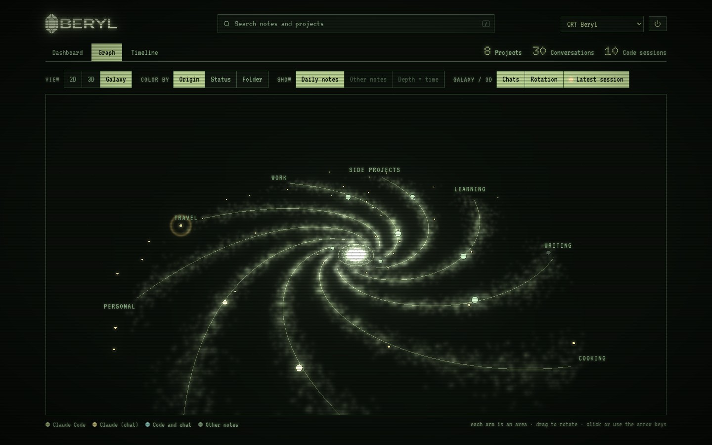
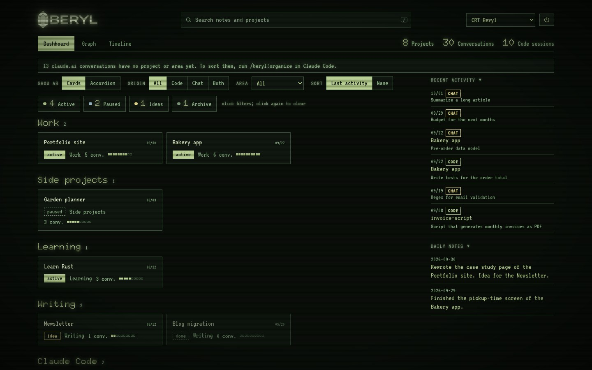
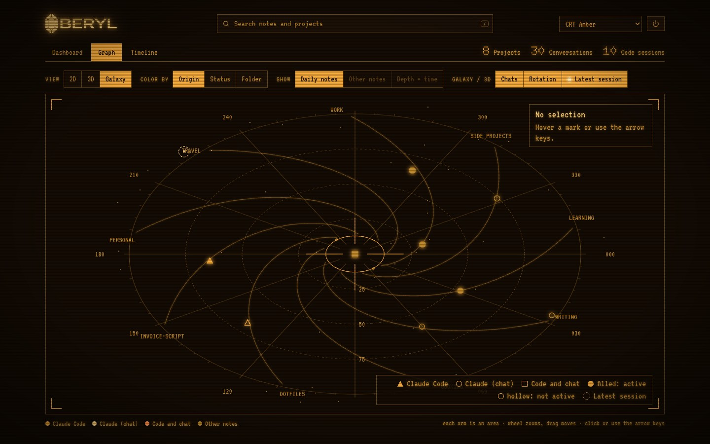
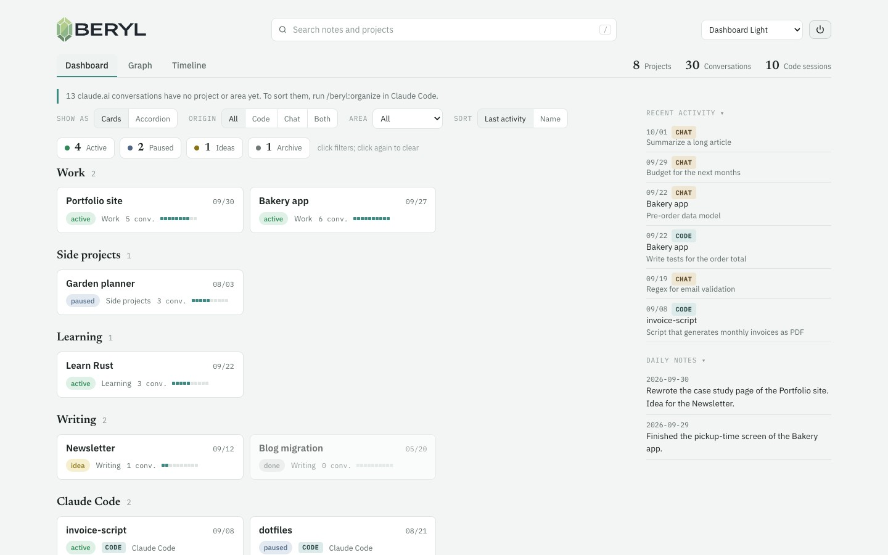

# Beryl

A local dashboard of your work with Claude, installed as a Claude Code plugin.

[Português](README.pt-BR.md)




Beryl reads three sources, all optional:

- **Claude Code sessions** (`~/.claude/projects`), grouped into projects by git repository.
- **Your claude.ai data export**: the `.zip`, its `conversations.json`, or a folder that receives the exports.
- **A folder of markdown notes**: an Obsidian vault or any other. Notes with `type: project` become projects.

It shows them in your browser, on your own machine:

- **Dashboard:** projects grouped by area, with status, origin (Claude Code, claude.ai or both), last activity and number of conversations. Filters, search, and two layouts: cards or accordion.
- **Graph:** notes, projects and links in 2D, 3D, or as a **Galaxy**, where each arm is an area and every conversation with Claude is a star. The latest session pulses.
- **Timeline:** one bar per project, with your daily notes on the axis.
- **Reader:** any note, conversation or session in a details window you can drag, with backlinks and the conversations linked to each project.




**Themes.** The list at the top right has five looks: **CRT Beryl** (the default) and **CRT Amber**, phosphor on black with scanlines, terminal type and a glowing logo; and **Dashboard Automatic**, **Light** and **Dark**, which follow your system or your choice. The Galaxy takes the phosphor of the CRT themes. The choice stays in your browser.

<table><tr>
<td></td>
<td></td>
</tr></table>

It also gives every Claude Code session the context of its project, through an MCP server: what the project is, its status, the decisions and what was already discussed. At the end of a session, Claude saves a one-line summary to the project's session log.

Nothing leaves your machine. The dashboard is a local server on `127.0.0.1`.

The name comes from beryl, the stone of the first eyeglass lenses and the eighth foundation of the New Jerusalem (Revelation 21:20). Your notes and conversations keep things; Beryl lets you see them.

## Install

**You need:**

- **Claude Code** with plugin support (the `/plugin` command).
- **Python 3.9 or later.** On macOS, `xcode-select --install` provides it; on Linux it comes with most distributions. Check with `python3 --version`.
- **macOS or Linux.** On Windows, use WSL.

Nothing else to install: Beryl uses only Python's standard library.

### 1. Install the plugin

Type these in the Claude Code prompt (not in the terminal):

```
/plugin marketplace add paulogabriel/beryl
/plugin install beryl@beryl
```

Or from the terminal:

```bash
claude plugin marketplace add paulogabriel/beryl
claude plugin install beryl@beryl
```

### 2. Choose what Beryl reads

Claude Code asks for the plugin options. Everything is optional: if you accept the defaults, Beryl shows your Claude Code sessions, and you can add the rest later. You can change the options afterwards in `/config`; the dashboard picks up a change within a few seconds.

| Option | What it does |
|---|---|
| Read Claude Code sessions | Show your Claude Code sessions and group them into projects. On by default. |
| claude.ai data export | The `.zip` from claude.ai (Settings › Privacy › Export data), its `conversations.json`, or a folder that holds exports (the newest one is used). Keep it somewhere safe: see below. |
| Notes folder | An Obsidian vault or any folder of markdown notes. |
| Language | `auto` (your system's), `en` or `pt`. Other languages fall back to English. |
| Write to project notes | Let Beryl change the status of project notes and add session summaries to them. Off by default: summaries then stay in Beryl's own data. |
| Beryl only in my projects | Claude sessions get Beryl's context only in your projects' folders and in the notes folder, not in repositories cloned from others. Off by default. |

**Getting your claude.ai export.** On claude.ai, open Settings › Privacy › Export data. claude.ai emails you a download link (the link expires, so download it soon). Then keep it somewhere safe (see below) and give Beryl that file or its folder. Without the export, Beryl still works; you just won't see your claude.ai conversations. The export is a snapshot, so ask for a new one now and then: the dashboard warns when the newest conversation is older than 14 days.

**Keep the export somewhere safe.** The export has the full text of every conversation you ever had on claude.ai, so treat it like a password file. Beryl only reads it, on your machine; the risk is where you leave it.

- Move the `.zip` out of Downloads into a folder only you use, such as `~/Private/claude-export`, and lock it with `chmod 700 ~/Private/claude-export`. Downloads is a busy place: browsers, apps and sites drop files there.
- Don't put it in a git repository, in a folder shared with other people, or in a synced folder that others can open.
- Keep disk encryption on (FileVault on macOS, LUKS on Linux), so the file stays unreadable if the computer is lost.
- Point Beryl at that `.zip` (or at that folder), not at Downloads.
- When you ask for a newer export, replace the old one and delete it, so old copies don't pile up.
- Never share the `.zip` or the file from `build` (see "Privacy and security").

### 3. Start a new Claude Code session

Close the current session and open a new one, so the MCP server and the hooks load.

### 4. Open the dashboard

In the new session:

```
/beryl:dashboard
```

The first time, Claude Code asks permission to run `python3`: that is Beryl's local server starting. Your browser then opens the dashboard. The server keeps running in the background and the page updates by itself; it stops after 2 hours with no open dashboard, and `/beryl:dashboard` starts it again.

If you also gave Beryl a claude.ai export, run `/beryl:organize` once: Claude proposes a project or area for each conversation and saves after you approve.

### Update and uninstall

```bash
claude plugin update beryl@beryl      # latest version (or /plugin update)
claude plugin uninstall beryl@beryl   # remove the plugin
```

Beryl's own data (hidden items, sorted conversations, the key of the running server) stays in `~/.claude/plugins/data/beryl-beryl`. Delete that folder to remove it. Your notes are never deleted.

### If something goes wrong

| What you see | What to do |
|---|---|
| `python3: command not found`, or Python older than 3.9 | Install Python 3.9 or later (see "You need" above) and run `/beryl:dashboard` again. |
| The browser didn't open | Run `/beryl:dashboard` again and open the address it prints. |
| "This address needs the key of the running server" | Open the dashboard with `/beryl:dashboard`, not with an old address: the key in the address works once. |
| "Beryl server stopped" strip on the page | The server stopped (idle or shut down). Run `/beryl:dashboard`. |
| "No source configured yet" | Turn on Read Claude Code sessions, or give a claude.ai export or a notes folder, in `/config`. |
| Port 8765 is taken by another program | Set another `port` in your settings file (see "Your own settings"). |
| Your claude.ai conversations don't show | Check the export path. If it is a folder, it needs a complete export (`conversations.json` with `users.json`). |

## Use

| Command | What it does |
|---|---|
| `/beryl:dashboard` | Opens the dashboard in your browser. The server keeps running in the background and the page updates by itself. The first time, Claude Code asks permission to run `python3`: that's Beryl's local server starting. |
| `/beryl:save` | Saves a short summary of the session to the project's session log. |
| `/beryl:organize` | Sorts your claude.ai conversations: Claude proposes a project or a topic area for each one and saves after you approve. |
| `/beryl:week` | A recap of the last 7 days (or `/beryl:week 14`), by project: what moved forward, decisions and what's pending. |

Without any command, Claude calls `beryl_context` when you start working on a project. When a session ends or you run `/compact`, a hook writes an automatic entry if nobody saved one.

### How projects are found

- **From notes:** a note with `type: project` (or `tipo: projeto`) is a project. Its `folder` (or `pasta`) property links it to the folders where you work on it; separate several folders with `·`.
- **From Claude Code:** sessions in a folder that no project note covers become one project per git repository, active if it had a session in the last 30 days.
- **From claude.ai:** the export doesn't say which Project a conversation belongs to, so new conversations arrive unsorted. Run `/beryl:organize` to sort them.

Note properties can be in English or Portuguese: `type`/`tipo`, `status`, `area`, `folder`/`pasta`, `last_activity`/`ultima_atividade`, `origin`/`origem`.

### MCP tools

| Tool | What it returns |
|---|---|
| `beryl_context` | The project of the current folder (or a named one): note, status, decisions, session log and recent conversations. |
| `beryl_search` | Notes and conversations that mention a term. |
| `beryl_projects` | All projects, with id, status, area and last activity. |
| `beryl_save_session` | Saves a summary to the session log of the current folder's project. |

## Try it without your data

The `demo/` folder has fictional notes, a claude.ai export and Claude Code sessions:

```bash
python3 beryl.py --config demo/beryl.json serve
```

## Privacy and security

- The server listens only on `127.0.0.1` and answers only requests addressed to it (`Host` and `Origin` checks), which blocks DNS rebinding. Other sites can't read your data or embed the dashboard (CSP with `frame-ancestors 'none'`).
- Each run of the server has its own secret key. The browser Beryl opens receives it as a cookie; other programs on the computer that reach `127.0.0.1` get no data without it.
- The data folder (with the claude.ai export and the key) is readable only by your user.
- The key in the address Beryl opens works once: an address left in the browser history opens nothing.
- When the export setting is a folder (such as Downloads), only a complete claude.ai export counts (`conversations.json` with `users.json`), so a file some site drops there isn't taken as your export. Exports over 2 GB aren't read.
- The server stops by itself after `idle_minutes` (2 hours) with no open dashboard; `/beryl:dashboard` starts it again.
- Writes accept only JSON from Beryl's own page, up to 64 KB, and only the status of writable project notes.
- Titles, summaries and first requests pass through a filter that masks API keys, tokens and private keys. The filter works by known formats: a loose password or a token in an unusual format can get through, so don't count on it as the only protection.
- The MCP shows other sessions only project notes and conversations already sorted, and nothing from the areas in `mcp_hidden_areas` (by default `personal` and `pessoal`). Unsorted conversations stay out.
- The session's folder is the MCP server's own working folder, not `CLAUDE_PROJECT_DIR`, which a repository could set in its own settings.
- `beryl_save_session` only writes to the project of the session's real folder: a malicious README in some repository can't make Claude write into another project's log. What Beryl returns to Claude is marked as data, not instructions.
- Session summaries are written as a single line, without links, images, HTML or `%%`.
- The server, the MCP and the hooks write under a shared file lock.
- `python3 beryl.py build` creates a single read-only HTML file with the titles and summaries of your conversations: don't share it.

## Without Claude Code

Beryl also runs on its own:

```bash
python3 beryl.py serve              # local site with live updates
python3 beryl.py open               # starts the server in the background, if needed, and opens the browser
python3 beryl.py build -o out.html  # a single read-only HTML file
```

Settings then come from a `beryl.json` next to `beryl.py` (see `beryl.example.json`) or from the path in `BERYL_CONFIG`. On macOS, `scripts/make-app.sh` creates `~/Applications/Beryl.app`, with the Beryl icon, for the Dock.

Beryl runs on the computer, next to your files: it can't be installed on a phone, and the server refuses connections from other devices on purpose. On a phone you can open the file from `build` (send it to yourself, for example by AirDrop): it is a snapshot of the moment it was built and doesn't update.

## Your own settings

Beryl keeps two things apart:

- **Defaults**, in the code: generic, the same for everyone, updated with Beryl.
- **Your settings**, in one local file that updates never touch: `beryl.json` in Beryl's data folder (`~/.claude/plugins/data/beryl-beryl/beryl.json` when installed as a plugin, or the path in `BERYL_CONFIG`). Your note conventions (your `type` values, your statuses, your areas) go there.

Any key you leave out keeps its default. The plugin options still take precedence for the four sources.

Example, for notes that use `tipo: projeto-claude` and a status of their own:

```json
{
  "project_types": ["projeto-claude", "projeto"],
  "statuses": ["ativo", "pausado", "funcional", "encerrado"],
  "status_groups": {"ativo": ["funcional"]},
  "area_order": ["work", "learning"]
}
```

| Key | Default | What it does |
|---|---|---|
| `notes`, `claude_code`, `claude_export`, `write_notes`, `mcp_only_projects` | | The same as the plugin options. |
| `language` | `auto` | `en`, `pt`, or `auto` (the system's; in the dashboard, the browser's). |
| `port` | `8765` | Port of the local server. |
| `export_warn_days` | `14` | The dashboard warns when the newest claude.ai conversation in the export is older than this; `0` turns it off. |
| `idle_minutes` | `120` | The server stops after this long with no open dashboard; `0` keeps it running. |
| `write_dirs` | | Note folders where Beryl may write, instead of "project notes". |
| `exclude` | `[]` | Note folders or files that are never read. |
| `project_types` | `projeto`, `project` | Values of `type` (or `tipo`) that make a note a project. |
| `statuses` | by language | Status choices in the details window. |
| `status_groups` | | Your own status words for the colors and filters: `{"ativo": [...], "pausado": [...], "continuo": [...], "ideia": [...], "encerrado": [...]}`. Common words (active, paused, idea, done…) are known already. |
| `auto_projects` | `true` | Turn Claude Code folders without a project note into projects. |
| `organize_file` | `organizacao.json` in the data folder | Where conversation sorting and hidden items are kept. A relative path is relative to the notes folder. |
| `mcp_hidden_areas` | `personal`, `pessoal` | Areas the MCP never shows to sessions. The dashboard still shows them. |
| `mcp_folders` | | Note folders the MCP may show besides project notes (`.` is the root). |
| `claude_folder` | | A notes folder kept by Claude (logs, decisions), shown as "Claude's memory". |
| `user_name` | | How the MCP refers to you. |
| `galaxy_core` | | Id (file name without `.md`) of the note at the center of the Galaxy. |
| `area_order` | | Order of the areas in the dashboard; the others follow alphabetically. |

## Delete

In the details window, **Delete…** asks for confirmation first. A conversation only disappears from Beryl: it stays in claude.ai or in Claude Code. A writable note goes to the Trash.

## Languages

The dashboard and what Beryl writes follow the `language` option: `auto` (your system's), `en` or `pt`. Languages Beryl doesn't have yet fall back to English. Adding one is a single file: see [CONTRIBUTING.md](CONTRIBUTING.md).

## Development

```bash
python3 -m unittest discover -s tests   # tests, on the demo data
scripts/release.sh X.Y.Z                 # on main: tests, plugin validation, version, tag and push
```

Changes go in `CHANGELOG.md` under `## Unreleased`. Tests run on macOS and Linux, Python 3.9 and 3.13, on every pull request.

## License

MIT
